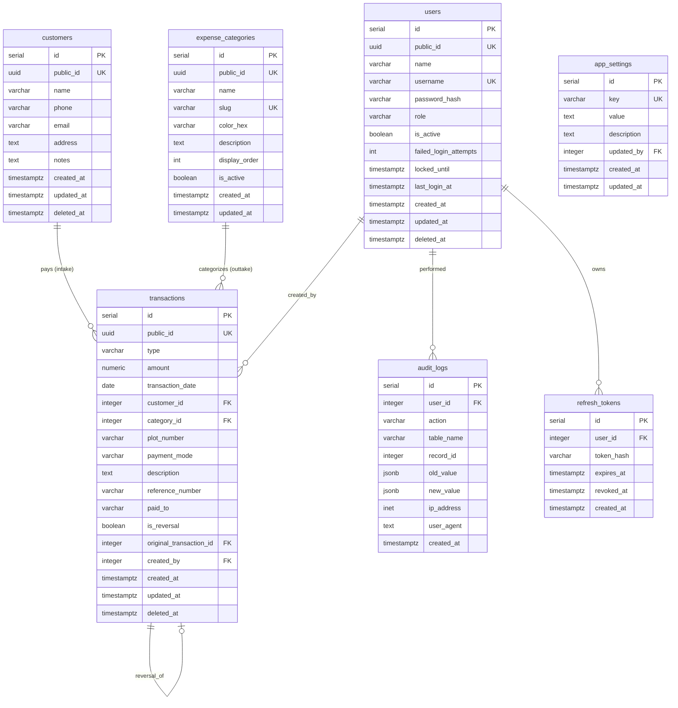

# DS Properties — Database Schema Review & Production Design

**Reviewer:** Staff Software Architect  
**Database:** PostgreSQL 15+  
**Source Document:** DSP_Backend_Schema_Implementation.pdf

---

## PART 1: Original Schema Analysis

### Tables Proposed (5):

| Table | Purpose | Verdict |
|-------|---------|---------|
| `users` | System users | Needs improvements |
| `customers` | Customer/buyer info | Needs improvements |
| `expense_categories` | Outtake categories | Needs improvements |
| `transactions` | Core financial records | Needs significant improvements |
| `audit_logs` | Change tracking | Acceptable, minor improvements |

---

### Issue Summary

| # | Table | Issue | Severity |
|---|-------|-------|----------|
| 1 | ALL | SERIAL IDs exposed externally — enumeration risk | Critical |
| 2 | ALL | Missing `updated_at` on users, customers, expense_categories | High |
| 3 | `users` | No `deleted_at` (uses `is_active` — inconsistent with other tables) | High |
| 4 | `users` | No failed login tracking fields | High |
| 5 | `transactions` | No CHECK constraints on `type`, `payment_mode` | High |
| 6 | `transactions` | No composite indexes for common query patterns | High |
| 7 | `transactions` | No partial index on `deleted_at IS NULL` | High |
| 8 | `customers` | `plot_number` should be on transactions, not customers | High |
| 9 | `transactions` | No `plot_number` field | High |
| 10 | — | No `refresh_tokens` table | High |
| 11 | — | No `app_settings` table for opening balance, config | Medium |
| 12 | `transactions` | Amount > 0 constraint prevents reversals | Medium |
| 13 | ALL FKs | No ON DELETE behavior specified | Medium |
| 14 | `users` | `role` VARCHAR with no CHECK constraint | Medium |
| 15 | `audit_logs` | No index on `table_name` for filtered queries | Low |

---

## PART 2: Production-Ready Schema Design

> [!IMPORTANT]
> This schema replaces the original proposal. All tables include consistent timestamp management, UUID public identifiers, CHECK constraints, and proper indexing.

### Design Principles Applied:
1. **UUIDs for external exposure** — all API-facing IDs use UUID
2. **SERIAL for internal joins** — integer PKs for performance
3. **Consistent soft deletes** — `deleted_at TIMESTAMPTZ` on all mutable entities
4. **Consistent timestamps** — `created_at`, `updated_at` on every table
5. **CHECK constraints** — on all enum-like VARCHAR fields
6. **Partial indexes** — `WHERE deleted_at IS NULL` for active record queries
7. **Composite indexes** — for common multi-column query patterns

---

### Table 1: `users`

```sql
CREATE TABLE users (
    id              SERIAL PRIMARY KEY,
    public_id       UUID NOT NULL DEFAULT gen_random_uuid() UNIQUE,
    name            VARCHAR(100) NOT NULL,
    username        VARCHAR(50) NOT NULL UNIQUE,
    password_hash   VARCHAR(255) NOT NULL,
    role            VARCHAR(20) NOT NULL CHECK (role IN ('admin', 'operator', 'viewer')),
    is_active       BOOLEAN NOT NULL DEFAULT TRUE,
    failed_login_attempts   INTEGER NOT NULL DEFAULT 0,
    locked_until    TIMESTAMPTZ,
    last_login_at   TIMESTAMPTZ,
    created_at      TIMESTAMPTZ NOT NULL DEFAULT NOW(),
    updated_at      TIMESTAMPTZ NOT NULL DEFAULT NOW(),
    deleted_at      TIMESTAMPTZ
);

-- Indexes
CREATE UNIQUE INDEX idx_users_username_active ON users(username) WHERE deleted_at IS NULL;
CREATE UNIQUE INDEX idx_users_public_id ON users(public_id);
```

**Changes from original:**
- Added `public_id UUID` for API exposure
- Added `role` CHECK constraint with 'viewer' option
- Added `failed_login_attempts`, `locked_until` for account lockout
- Added `updated_at`, `deleted_at` for consistency

---

### Table 2: `customers`

```sql
CREATE TABLE customers (
    id              SERIAL PRIMARY KEY,
    public_id       UUID NOT NULL DEFAULT gen_random_uuid() UNIQUE,
    name            VARCHAR(150) NOT NULL,
    phone           VARCHAR(15),
    email           VARCHAR(255),
    address         TEXT,
    notes           TEXT,
    created_at      TIMESTAMPTZ NOT NULL DEFAULT NOW(),
    updated_at      TIMESTAMPTZ NOT NULL DEFAULT NOW(),
    deleted_at      TIMESTAMPTZ
);

-- Indexes
CREATE INDEX idx_customers_name ON customers(name) WHERE deleted_at IS NULL;
CREATE INDEX idx_customers_phone ON customers(phone) WHERE deleted_at IS NULL AND phone IS NOT NULL;
CREATE UNIQUE INDEX idx_customers_public_id ON customers(public_id);
```

**Changes from original:**
- **Removed `plot_number`** — moved to transactions table (a customer can have payments for multiple plots)
- Added `public_id UUID` for API exposure
- Added `email` (optional, useful for future communication)
- Added `notes` (admin notes about customer)
- Added `updated_at`
- Added name index for typeahead search

---

### Table 3: `expense_categories`

```sql
CREATE TABLE expense_categories (
    id              SERIAL PRIMARY KEY,
    public_id       UUID NOT NULL DEFAULT gen_random_uuid() UNIQUE,
    name            VARCHAR(100) NOT NULL,
    slug            VARCHAR(100) NOT NULL UNIQUE,
    color_hex       VARCHAR(7) NOT NULL DEFAULT '#6B7280',
    description     TEXT,
    display_order   INTEGER NOT NULL DEFAULT 0,
    is_active       BOOLEAN NOT NULL DEFAULT TRUE,
    created_at      TIMESTAMPTZ NOT NULL DEFAULT NOW(),
    updated_at      TIMESTAMPTZ NOT NULL DEFAULT NOW()
);

CREATE UNIQUE INDEX idx_categories_public_id ON expense_categories(public_id);
CREATE INDEX idx_categories_active ON expense_categories(is_active, display_order);
```

**Changes from original:**
- Added `public_id UUID`
- Added `slug` (URL-friendly identifier, e.g., 'road-construction')
- Added `display_order` for consistent UI ordering
- Made `color_hex` NOT NULL with default
- Added `updated_at`
- No soft delete needed — use `is_active` flag (categories are config, not transactional data)

---

### Table 4: `transactions` (Core Table)

```sql
CREATE TABLE transactions (
    id                  SERIAL PRIMARY KEY,
    public_id           UUID NOT NULL DEFAULT gen_random_uuid() UNIQUE,
    type                VARCHAR(10) NOT NULL CHECK (type IN ('intake', 'outtake')),
    amount              NUMERIC(15, 2) NOT NULL CHECK (amount > 0),
    transaction_date    DATE NOT NULL,
    customer_id         INTEGER REFERENCES customers(id) ON DELETE RESTRICT,
    category_id         INTEGER REFERENCES expense_categories(id) ON DELETE RESTRICT,
    plot_number         VARCHAR(50),
    payment_mode        VARCHAR(20) NOT NULL CHECK (payment_mode IN ('cash', 'cheque', 'upi', 'bank_transfer')),
    description         TEXT,
    reference_number    VARCHAR(100),
    paid_to             VARCHAR(150),
    is_reversal         BOOLEAN NOT NULL DEFAULT FALSE,
    original_transaction_id INTEGER REFERENCES transactions(id),
    created_by          INTEGER NOT NULL REFERENCES users(id) ON DELETE RESTRICT,
    created_at          TIMESTAMPTZ NOT NULL DEFAULT NOW(),
    updated_at          TIMESTAMPTZ NOT NULL DEFAULT NOW(),
    deleted_at          TIMESTAMPTZ,

    -- Business rules enforced at DB level
    CONSTRAINT chk_intake_customer CHECK (
        (type = 'intake' AND customer_id IS NOT NULL) OR type = 'outtake'
    ),
    CONSTRAINT chk_outtake_category CHECK (
        (type = 'outtake' AND category_id IS NOT NULL) OR type = 'intake'
    ),
    CONSTRAINT chk_reversal_reference CHECK (
        (is_reversal = TRUE AND original_transaction_id IS NOT NULL) OR is_reversal = FALSE
    )
);

-- Primary query indexes (partial — exclude soft-deleted records)
CREATE UNIQUE INDEX idx_txn_public_id ON transactions(public_id);
CREATE INDEX idx_txn_type_date ON transactions(type, transaction_date) WHERE deleted_at IS NULL;
CREATE INDEX idx_txn_customer_date ON transactions(customer_id, transaction_date) WHERE deleted_at IS NULL AND customer_id IS NOT NULL;
CREATE INDEX idx_txn_category_date ON transactions(category_id, transaction_date) WHERE deleted_at IS NULL AND category_id IS NOT NULL;
CREATE INDEX idx_txn_created_at ON transactions(created_at) WHERE deleted_at IS NULL;
CREATE INDEX idx_txn_date ON transactions(transaction_date) WHERE deleted_at IS NULL;
CREATE INDEX idx_txn_created_by ON transactions(created_by);
CREATE INDEX idx_txn_payment_mode ON transactions(payment_mode) WHERE deleted_at IS NULL;
```

**Changes from original:**
- Added `public_id UUID`
- Added CHECK constraints on `type` and `payment_mode`
- **Added `plot_number`** (moved from customers table)
- Added `is_reversal` and `original_transaction_id` for correction handling
- Added CHECK constraints for business rules:
  - Intake MUST have a customer_id
  - Outtake MUST have a category_id
  - Reversals MUST reference original transaction
- Added ON DELETE RESTRICT on all foreign keys
- **Replaced single-column indexes with composite indexes** for query optimization
- All partial indexes exclude soft-deleted records

---

### Table 5: `audit_logs`

```sql
CREATE TABLE audit_logs (
    id              SERIAL PRIMARY KEY,
    user_id         INTEGER REFERENCES users(id) ON DELETE RESTRICT,
    action          VARCHAR(20) NOT NULL CHECK (action IN ('create', 'update', 'delete', 'login', 'login_failed', 'logout', 'password_change')),
    table_name      VARCHAR(50) NOT NULL,
    record_id       INTEGER,
    old_value        JSONB,
    new_value        JSONB,
    ip_address      INET,
    user_agent      TEXT,
    created_at      TIMESTAMPTZ NOT NULL DEFAULT NOW()
);

-- Indexes
CREATE INDEX idx_audit_user_created ON audit_logs(user_id, created_at);
CREATE INDEX idx_audit_table_record ON audit_logs(table_name, record_id);
CREATE INDEX idx_audit_action ON audit_logs(action, created_at);
CREATE INDEX idx_audit_created_at ON audit_logs(created_at);
```

**Changes from original:**
- Added authentication actions to CHECK constraint
- Added `user_agent` for security forensics
- Made `record_id` nullable (auth events have no record)
- Added index on `table_name, record_id` for record-level audit queries
- Added index on `action, created_at` for security event queries

---

### Table 6: `refresh_tokens` (NEW)

```sql
CREATE TABLE refresh_tokens (
    id              SERIAL PRIMARY KEY,
    user_id         INTEGER NOT NULL REFERENCES users(id) ON DELETE CASCADE,
    token_hash      VARCHAR(255) NOT NULL,
    expires_at      TIMESTAMPTZ NOT NULL,
    revoked_at      TIMESTAMPTZ,
    created_at      TIMESTAMPTZ NOT NULL DEFAULT NOW(),

    CONSTRAINT chk_expiry CHECK (expires_at > created_at)
);

-- Indexes
CREATE INDEX idx_refresh_user ON refresh_tokens(user_id) WHERE revoked_at IS NULL;
CREATE INDEX idx_refresh_token ON refresh_tokens(token_hash) WHERE revoked_at IS NULL;
CREATE INDEX idx_refresh_expiry ON refresh_tokens(expires_at);
```

**Purpose:** Stores hashed refresh tokens for:
- Token revocation (logout)
- Session management (admin can see active sessions)
- Detecting token reuse (potential theft)

---

### Table 7: `app_settings` (NEW)

```sql
CREATE TABLE app_settings (
    id              SERIAL PRIMARY KEY,
    key             VARCHAR(100) NOT NULL UNIQUE,
    value           TEXT NOT NULL,
    description     TEXT,
    updated_by      INTEGER REFERENCES users(id),
    created_at      TIMESTAMPTZ NOT NULL DEFAULT NOW(),
    updated_at      TIMESTAMPTZ NOT NULL DEFAULT NOW()
);
```

**Purpose:** Stores system-wide configuration:
- `opening_balance` — Initial cash balance when system goes live
- `company_name` — "DS Properties"
- `company_address` — For report headers
- `currency_symbol` — "₹"
- `financial_year_start` — April (India standard)

---

## PART 3: Auto-Update Trigger

```sql
-- Function to auto-update updated_at on row modification
CREATE OR REPLACE FUNCTION trigger_set_updated_at()
RETURNS TRIGGER AS $$
BEGIN
    NEW.updated_at = NOW();
    RETURN NEW;
END;
$$ LANGUAGE plpgsql;

-- Apply to all tables with updated_at
CREATE TRIGGER set_updated_at BEFORE UPDATE ON users
    FOR EACH ROW EXECUTE FUNCTION trigger_set_updated_at();

CREATE TRIGGER set_updated_at BEFORE UPDATE ON customers
    FOR EACH ROW EXECUTE FUNCTION trigger_set_updated_at();

CREATE TRIGGER set_updated_at BEFORE UPDATE ON expense_categories
    FOR EACH ROW EXECUTE FUNCTION trigger_set_updated_at();

CREATE TRIGGER set_updated_at BEFORE UPDATE ON transactions
    FOR EACH ROW EXECUTE FUNCTION trigger_set_updated_at();

CREATE TRIGGER set_updated_at BEFORE UPDATE ON app_settings
    FOR EACH ROW EXECUTE FUNCTION trigger_set_updated_at();
```

---

## PART 4: Seed Data

### Default Expense Categories

```sql
INSERT INTO expense_categories (name, slug, color_hex, description, display_order) VALUES
    ('Road Construction',   'road-construction',   '#EF4444', 'Internal roads, leveling, surfacing',           1),
    ('Gutter & Drainage',   'gutter-drainage',     '#F97316', 'Gutter laying, drainage pipes, stormwater',     2),
    ('Boundary Wall',       'boundary-wall',       '#EAB308', 'Compound wall, fencing, gate construction',     3),
    ('Labor Charges',       'labor-charges',       '#8B5CF6', 'Daily wages, contractor payments',              4),
    ('Materials',           'materials',           '#06B6D4', 'Cement, sand, bricks, steel, hardware',         5),
    ('Admin & Legal',       'admin-legal',         '#64748B', 'Registration, documentation, office expenses',  6),
    ('Other',               'other',               '#9CA3AF', 'Miscellaneous expenses',                       7);
```

### Default Admin User

```sql
-- Password should be set via application seeding script (bcrypt hash)
INSERT INTO users (name, username, password_hash, role) VALUES
    ('DS Properties Admin', 'admin', '<bcrypt_hash_of_initial_password>', 'admin');
```

### Default App Settings

```sql
INSERT INTO app_settings (key, value, description) VALUES
    ('opening_balance', '0', 'Opening cash balance when system went live'),
    ('company_name', 'DS Properties', 'Business name for reports'),
    ('currency_symbol', '₹', 'Currency symbol for display'),
    ('financial_year_start_month', '4', 'April = Indian FY start');
```

---

## PART 5: Entity Relationship Diagram



---

## PART 6: Migration Strategy

All schema changes should be managed via numbered SQL migration files:

```
migrations/
├── 001_create_users.sql
├── 002_create_customers.sql
├── 003_create_expense_categories.sql
├── 004_create_transactions.sql
├── 005_create_audit_logs.sql
├── 006_create_refresh_tokens.sql
├── 007_create_app_settings.sql
├── 008_create_triggers.sql
├── 009_seed_categories.sql
├── 010_seed_admin_user.sql
├── 011_seed_app_settings.sql
```

Each migration file should be idempotent (use `IF NOT EXISTS` where applicable) and should include both `UP` and `DOWN` sections for rollback capability.
