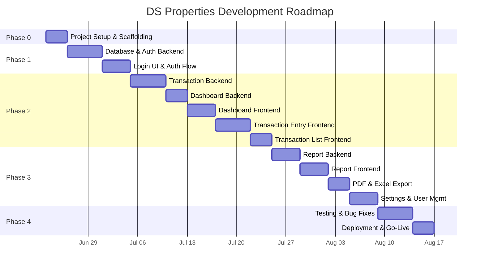

# DS Properties — Development Roadmap

**Version:** 1.0  
**Date:** June 2025  
**Total Duration:** 10 weeks (includes buffer)

---

## Overview

The project is broken into **5 phases**, each building on the previous. Every phase ends with a testable, deployable increment.

---

## Phase 0: Project Setup & Scaffolding (3 days)

### Goal
Establish the complete project skeleton with development tooling, configurations, and local development environment. Every developer (human or AI) should be able to clone and run the project after this phase.

### Deliverables
- [x] Git repository initialized with `.gitignore`
- [ ] Backend Node.js project with Express, ESLint, Prettier
- [ ] Frontend React project with Vite, Tailwind CSS (custom theme)
- [ ] Docker Compose for local PostgreSQL
- [ ] Environment variable templates (`.env.example`)
- [ ] README with setup instructions
- [ ] Design system CSS foundation (colors, typography, spacing)

### Dependencies
- Node.js 20 LTS installed
- PostgreSQL 15+ (via Docker or local)
- Git

### Estimated Complexity: **Low**

### Implementation Order
1. Initialize git repo, `.gitignore`, `.nvmrc`
2. Scaffold backend (`npm init`, install deps, folder structure)
3. Scaffold frontend (`npm create vite@latest`, Tailwind config)
4. Docker Compose for PostgreSQL
5. Design system foundation (Tailwind config + base CSS)
6. README with dev setup instructions

---

## Phase 1: Foundation — Database & Authentication (9 days)

### Goal
Working database schema, user authentication (login/logout/refresh), JWT middleware, role-based access control, and a functional login UI.

### Deliverables
- [ ] All database migrations executed (7 tables)
- [ ] Database triggers (auto `updated_at`)
- [ ] Seed data (categories, admin user, app settings)
- [ ] Auth API: login, refresh, logout, change-password
- [ ] JWT middleware with role extraction
- [ ] Role-based authorization middleware
- [ ] Account lockout on failed logins
- [ ] Audit logging for auth events
- [ ] Login page UI
- [ ] Auth context (React) with token management
- [ ] Protected route component
- [ ] App layout (sidebar, header, bottom nav)

### Dependencies
- Phase 0 complete
- PostgreSQL running

### Estimated Complexity: **Medium**

### Implementation Order
1. Migration files (001-011)
2. Database connection config (`pg` pool)
3. Environment config and constants
4. User model (CRUD queries)
5. Refresh token model
6. Auth service (login, hash, token generation)
7. Auth controller + routes
8. JWT authentication middleware
9. Role authorization middleware
10. Rate limiting middleware
11. Request logging middleware
12. Global error handler middleware
13. Audit logging middleware
14. Frontend: Auth context + token storage
15. Frontend: Login page
16. Frontend: App layout (sidebar, bottom nav, header)
17. Frontend: Protected route component

### Exit Criteria
- Admin can log in, get JWT, and access protected routes
- Refresh token flow works
- Unauthorized requests return 401
- Wrong-role requests return 403
- Account locks after 5 failures
- Login/logout events recorded in audit log

---

## Phase 2: Core Features — Transactions & Dashboard (20 days)

### Goal
Complete transaction CRUD (intake + outtake), customer management, dashboard with summary cards and charts, and the transaction list view with search/filter.

### Deliverables
- [ ] Customer CRUD API
- [ ] Category CRUD API (admin only)
- [ ] Transaction create API with validation
- [ ] Transaction list API with filtering/pagination/search
- [ ] Transaction update (admin) + delete (admin, password-protected)
- [ ] Dashboard summary API with caching
- [ ] Duplicate detection logic
- [ ] Large amount warning logic
- [ ] Dashboard UI: 4 summary cards
- [ ] Dashboard UI: Category pie chart
- [ ] Dashboard UI: Today's transactions
- [ ] Add Entry page: Intake form with customer typeahead
- [ ] Add Entry page: Outtake form with category chips
- [ ] Review/confirmation modal
- [ ] Success screen with balance update
- [ ] Transaction list page with filters
- [ ] Transaction detail view
- [ ] Edit transaction modal (admin)
- [ ] Delete confirmation dialog (admin)

### Dependencies
- Phase 1 complete (auth working)
- Customer and category seed data

### Estimated Complexity: **High** (this is the core of the application)

### Implementation Order

**Backend (8 days):**
1. Customer model + service + controller + routes + validators
2. Category model + service + controller + routes + validators
3. Transaction model (create + validation logic)
4. Transaction service (business rules, duplicate detection, warnings)
5. Transaction controller + routes
6. Transaction list with filtering, search, pagination
7. Transaction update/delete (admin, audit logged)
8. Dashboard service (aggregation queries, caching)
9. Dashboard controller + routes

**Frontend (12 days):**
10. API client setup (axios instance + interceptors)
11. Common components: Button, Input, Select, Card, Modal, Toast
12. AmountInput component (INR formatting)
13. Dashboard page: Summary cards
14. Dashboard page: Category pie chart (Chart.js)
15. Dashboard page: Today's transactions list
16. Customer API module + typeahead component
17. Add Entry page: Tab switcher (Intake/Outtake)
18. Intake form with validation
19. Outtake form with category chips
20. Review modal + success screen
21. Transaction list page with TransactionRow component
22. Transaction filters component (date range, type, category, search)
23. Pagination component
24. Transaction detail view
25. Edit transaction modal + delete confirmation (admin)

### Exit Criteria
- Operator can create intake and outtake transactions
- Dashboard shows accurate totals, balance, and category breakdown
- Transactions list supports filtering by type, date, category, search
- Admin can edit and soft-delete transactions
- Duplicate warnings appear correctly
- Large amount confirmation works
- Pie chart renders category breakdown
- All forms validate correctly (client + server)

---

## Phase 3: Reports, Export & Settings (15 days)

### Goal
All 4 report types working, PDF and Excel export, user management, category management, and settings screen.

### Deliverables
- [ ] Daily report API
- [ ] Monthly report API (with category breakdown + weekly trend)
- [ ] Customer ledger API
- [ ] Category report API
- [ ] Report export endpoint (PDF + Excel)
- [ ] Daily report UI
- [ ] Monthly report UI with summary table
- [ ] Customer ledger UI with customer search
- [ ] Category report UI
- [ ] PDF export (jsPDF)
- [ ] Excel export (ExcelJS)
- [ ] User management CRUD UI (admin)
- [ ] Category management UI (admin)
- [ ] Change password UI
- [ ] Admin reset password UI
- [ ] Settings page (opening balance, company info)
- [ ] Audit log viewer (admin)

### Dependencies
- Phase 2 complete (transactions + dashboard working)
- Transaction data exists for testing reports

### Estimated Complexity: **Medium-High**

### Implementation Order

**Backend (4 days):**
1. Report service: daily, monthly, customer ledger, category
2. Report controller + routes + validators
3. User management controller + routes (admin only)
4. Settings controller + routes
5. Audit log query endpoint (admin only)

**Frontend (11 days):**
6. Reports page: Tab navigation (Daily, Monthly, Customer, Category)
7. Daily report component (date picker + table)
8. Monthly report component (month/year picker + summary table)
9. Customer ledger component (customer search + transaction table)
10. Category report component (category picker + expense table)
11. ExportButtons component
12. PDF export utility (jsPDF + autotable)
13. Excel export utility (ExcelJS)
14. User management page (list, create, edit, deactivate)
15. Category management (edit name, color, active status, display order)
16. Change password form
17. Settings page (opening balance, company name)
18. Audit log viewer (admin — table with filters)

### Exit Criteria
- All 4 report types generate correct data
- PDF downloads with proper formatting (DS Properties header, tables)
- Excel downloads with proper columns and formatting
- Admin can create/deactivate users
- Admin can manage categories
- Any user can change own password
- Admin can view audit trail
- Opening balance is configurable and reflected in balance calculation

---

## Phase 4: Testing, Polish & Deployment (8 days)

### Goal
Production-ready application with testing, bug fixes, responsive polish, performance validation, and production deployment.

### Deliverables
- [ ] Backend unit tests (services, validators)
- [ ] API integration tests (all endpoints)
- [ ] Frontend component tests (forms, key components)
- [ ] Balance accuracy verification
- [ ] Mobile responsiveness audit and fixes
- [ ] Loading states, skeleton screens, empty states
- [ ] Error handling polish (user-friendly error messages)
- [ ] Performance testing (1000+ transactions)
- [ ] VPS setup (Node.js, PostgreSQL, Nginx, PM2)
- [ ] SSL certificate (Let's Encrypt)
- [ ] Backup cron job
- [ ] Production deployment
- [ ] Admin password change from default
- [ ] Staff training materials
- [ ] Go-live monitoring (1 week)

### Dependencies
- Phase 3 complete
- VPS credentials from client
- Domain name configured

### Estimated Complexity: **Medium**

### Implementation Order

**Testing (3 days):**
1. Unit tests: authService, transactionService, dashboardService
2. Unit tests: all validators, formatters, utils
3. Integration tests: auth endpoints
4. Integration tests: transaction CRUD
5. Integration tests: dashboard, reports
6. Balance accuracy test: seed 100 transactions, verify totals

**Polish (2 days):**
7. Loading states and skeleton screens on all pages
8. Empty state components (no transactions, no results)
9. Mobile responsiveness fixes (test on 375px, 768px, 1024px)
10. Error toast messages for all API failures
11. SessionStorage form preservation on session expiry

**Deployment (3 days):**
12. VPS setup: install Node.js, PostgreSQL, Nginx
13. Nginx config with SSL (Let's Encrypt + Certbot)
14. PM2 ecosystem config
15. Environment variables set
16. Database migration + seed on production
17. Backup cron job setup (2 AM IST → S3/Backblaze)
18. Deploy backend + frontend
19. Smoke test all flows on production
20. Change admin default password
21. Monitor for 1 week

### Exit Criteria
- All tests pass
- Balance accuracy: 100% match on test data
- All pages render correctly on mobile, tablet, desktop
- HTTPS working with auto-renewal
- Backup cron verified (test restore)
- Application loads in < 2 seconds
- API responses under 500ms (p95)
- Staff can use the system independently after 30-min training

---

## Phase 2 (Future): Enhancements

> [!NOTE]
> These features are explicitly out of scope for the initial build but documented for future planning.

| Feature | Priority | Estimated Effort |
|---------|----------|-----------------|
| Offline entry with sync | High | 2-3 weeks |
| Multi-site/project support | Medium | 1-2 weeks |
| Receipt/bill image attachments | Medium | 1 week |
| Customer outstanding tracking (plot pricing) | Medium | 1-2 weeks |
| CSV/Excel data import utility | High | 1 week |
| Dark mode | Low | 3-4 days |
| Dashboard PDF export | Low | 2-3 days |
| Email notifications | Low | 1 week |
| Plot sales management | Low | 3-4 weeks |

---

## Feature Breakdown Table

| Feature | Business Value | Priority | Backend Tasks | Frontend Tasks | DB Requirements | Testing |
|---------|---------------|----------|---------------|----------------|-----------------|---------|
| User Authentication | Security foundation | P0-Critical | Login/refresh/logout API, JWT middleware, bcrypt | Login page, auth context, protected routes | users, refresh_tokens tables | Auth flow tests, lockout tests |
| Transaction Entry (Intake) | Core business — tracks income | P0-Critical | POST /transactions with validation, duplicate check | Intake form, customer typeahead, review modal | transactions, customers tables | Form validation, duplicate detection, balance update |
| Transaction Entry (Outtake) | Core business — tracks expenses | P0-Critical | POST /transactions with category validation | Outtake form, category chips, review modal | transactions, expense_categories tables | Form validation, category assignment |
| Dashboard | Business visibility | P0-Critical | Aggregation queries, caching | Summary cards, pie chart, today's list | Composite indexes on transactions | Balance accuracy, cache invalidation |
| Transaction List | Operations management | P1-High | GET /transactions with filters, pagination | List view, filters, search, detail view | Indexes on date, type, customer, category | Filter combinations, pagination |
| Transaction Edit/Delete | Data correction | P1-High | PUT/DELETE (admin only, audit logged) | Edit modal, delete confirmation | Audit logs | RBAC enforcement, audit trail |
| Daily Report | Accountability | P1-High | Aggregation query by date | Date picker, transaction table | Indexes on transaction_date | Data accuracy |
| Monthly Report | Strategic planning | P1-High | Monthly aggregation with category breakdown | Month picker, summary table, weekly trend | Composite indexes | Cross-month accuracy |
| Customer Ledger | Customer tracking | P1-High | Customer transaction aggregation | Customer search, payment history | Index on customer_id | Multi-payment tracking |
| Category Report | Spending analysis | P2-Medium | Category expense aggregation | Category selector, expense table | Index on category_id | Category totals |
| PDF Export | Record keeping | P2-Medium | N/A (client-side) | jsPDF generation with formatting | N/A | File download, formatting |
| Excel Export | Data analysis | P2-Medium | N/A (client-side) | ExcelJS generation | N/A | File download, column accuracy |
| User Management | Access control | P2-Medium | User CRUD API (admin) | User list, create/edit forms | users table | RBAC, last admin protection |
| Category Management | Customization | P2-Medium | Category update API | Category list, edit form | expense_categories table | Active/inactive toggle |
| Change Password | Security | P2-Medium | Password change API | Password form | users table | Old password verification |
| Settings | Configuration | P3-Low | Settings CRUD API | Settings form | app_settings table | Opening balance update |
| Audit Log Viewer | Accountability | P3-Low | Audit log query API | Audit log table with filters | audit_logs table | Filter by user, action, date |
