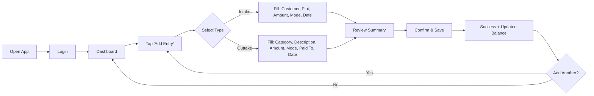
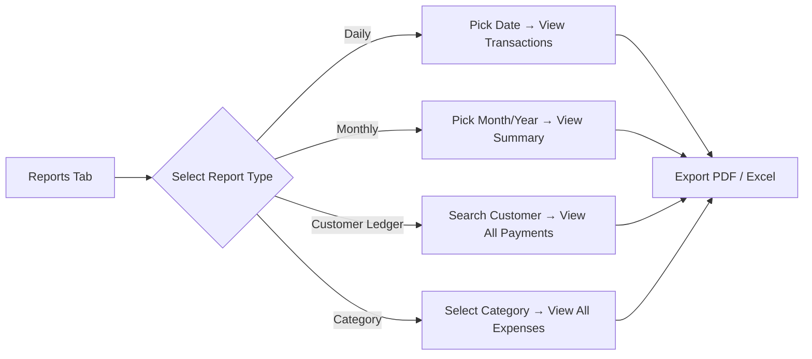
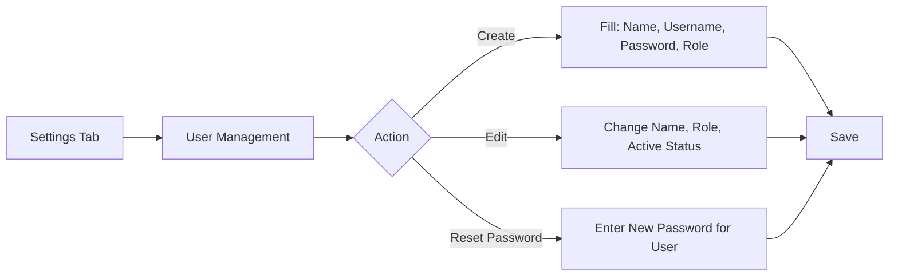

# DS Properties — Project Master Plan

**Version:** 1.0 (Revised — Post Architecture Review)  
**Date:** June 2025  
**Prepared by:** Principal Software Architect  
**Client:** DS Properties

---

## Document Understanding Summary

> [!NOTE]
> This master plan is based on thorough analysis of all 5 project documents (PRD, TRD, App Flow, Backend Schema, UI/UX Design Brief) **after** a critical architecture review that identified 33 issues (3 critical, 15 high, 11 medium, 4 low). The plan incorporates all recommended improvements.

### System Identity
**DS Properties Financial Tracking System (FTS)** — a web-based application for a land plotting business to track all financial inflows (customer payments) and outflows (construction expenses), maintain a real-time cash balance, and generate financial reports.

---

## 1. Business Goals

| # | Goal | Success Metric |
|---|------|----------------|
| 1 | Track all customer payments with dates, amounts, and plot references | Every intake transaction recorded with customer linkage |
| 2 | Track all construction expenses with automatic categorization | 7 predefined categories, admin-configurable |
| 3 | Maintain a running cash balance at all times | Balance = Opening Balance + Σ Intake - Σ Outtake, 100% accurate |
| 4 | Generate daily, weekly, monthly financial summaries | Report generation under 10 seconds |
| 5 | Provide a simple interface requiring minimal training | Full staff adoption within 2 weeks, < 2 min per transaction |
| 6 | Secure financial data with role-based access | Admin vs Operator vs Viewer permissions enforced |
| 7 | Automated backups with disaster recovery capability | Daily pg_dump to offsite storage, 30-day retention |

---

## 2. User Roles (Revised — 3 Roles)

> [!IMPORTANT]
> The original documents were inconsistent on roles (PRD: 3, App Flow: 2). This plan standardizes on 3 roles to honor the PRD's Site Supervisor requirement.

| Role | Identity | Access Level | Permissions |
|------|----------|-------------|-------------|
| **Admin** | Business Owner | Full | All CRUD + user management + settings + delete (with password re-entry) |
| **Operator** | Office Staff / Accountant | Standard | Create transactions + view dashboard + view reports (no edit/delete/user-mgmt) |
| **Viewer** | Site Supervisor | Read-only | View dashboard + view reports (no create/edit/delete) |

---

## 3. Core Workflows

### 3.1 Transaction Entry (Primary Workflow)


### 3.2 Report Generation


### 3.3 User Management (Admin Only)


---

## 4. Functional Requirements (Revised)

### 4.1 Transaction Management
| # | Requirement | Source | Status |
|---|------------|--------|--------|
| FR-01 | Enter intake transactions: customer, amount, plot, payment mode, date, notes | PRD 4.1 | ✅ In scope |
| FR-02 | Enter outtake transactions: category, amount, description, payment mode, paid_to, date, notes | PRD 4.1 | ✅ In scope |
| FR-03 | Auto-fill today's date with override capability | PRD 4.1 | ✅ In scope |
| FR-04 | Confirmation/review screen before saving | PRD 4.1 | ✅ In scope |
| FR-05 | Edit transactions (admin only) | App Flow 3.5 | ✅ In scope |
| FR-06 | Soft-delete transactions (admin only, password required) | PRD 5 | ✅ In scope |
| FR-07 | Transaction reversal support | Architecture Review | ✅ Added |
| FR-08 | Duplicate entry detection (warning, not blocking) | App Flow 4 | ✅ In scope |
| FR-09 | Large amount confirmation (> ₹10,00,000) | App Flow 4 | ✅ In scope |
| FR-10 | Negative balance warning (non-blocking) | App Flow 4 | ✅ In scope |

### 4.2 Dashboard
| # | Requirement | Source | Status |
|---|------------|--------|--------|
| FR-11 | Total intake (all time) | PRD 4.3 | ✅ |
| FR-12 | Total outtake (all time) with category breakdown | PRD 4.3 | ✅ |
| FR-13 | Current balance (intake minus outtake plus opening balance) | PRD 4.3, Arch Review | ✅ Revised |
| FR-14 | This month's summary with trend vs last month | PRD 4.3 | ✅ |
| FR-15 | Today's transactions (most recent 10) | App Flow 3.2 | ✅ |
| FR-16 | Category-wise expense pie chart | App Flow 3.2 | ✅ |
| FR-17 | Dashboard date range filter | PRD 4.5 | ✅ |

### 4.3 Reports
| # | Requirement | Source | Status |
|---|------------|--------|--------|
| FR-18 | Daily report: all transactions for a date | PRD 4.4 | ✅ |
| FR-19 | Monthly report: categorized summary | PRD 4.4 | ✅ |
| FR-20 | Customer ledger: all payments from a customer | PRD 4.4 | ✅ |
| FR-21 | Category report: all expenses in a category | PRD 4.4 | ✅ |
| FR-22 | Export to PDF | PRD 4.4 | ✅ |
| FR-23 | Export to Excel | PRD 4.4 | ✅ |

### 4.4 Search & Filter
| # | Requirement | Source | Status |
|---|------------|--------|--------|
| FR-24 | Search by customer name, date range, amount, category | PRD 4.5 | ✅ |
| FR-25 | Filter by type (intake/outtake), date range, payment mode | App Flow 3.5 | ✅ |

### 4.5 User & Settings Management
| # | Requirement | Source | Status |
|---|------------|--------|--------|
| FR-26 | User CRUD (admin only) | App Flow 2 | ✅ |
| FR-27 | Category management (admin only) | App Flow 2 | ✅ |
| FR-28 | Change own password | App Flow 2 | ✅ |
| FR-29 | Admin reset any user's password | Arch Review | ✅ Added |
| FR-30 | Opening balance configuration | Arch Review | ✅ Added |

---

## 5. Non-Functional Requirements (Revised)

| # | Requirement | Target | Source | Notes |
|---|------------|--------|--------|-------|
| NFR-01 | Page load time | < 2 seconds | PRD 5 | — |
| NFR-02 | API response time (p95) | < 500ms | TRD 4 | — |
| NFR-03 | Report generation time | < 10 seconds | PRD 7 | — |
| NFR-04 | Usability | Trainable in < 30 minutes | PRD 5 | — |
| NFR-05 | Availability | 99% uptime | PRD 5 | Single VPS acceptable for Phase 1 |
| NFR-06 | Mobile responsive | Works on smartphones | PRD 5 | Mobile-first design |
| NFR-07 | Daily automated backups | 2:00 AM IST to offsite | TRD 5 | — |
| NFR-08 | Soft delete only | No physical deletion | TRD 5 | — |
| NFR-09 | Audit trail | Every mutation logged | TRD 5 | — |
| NFR-10 | Offline entry | **Descoped to Phase 2** | PRD 5 | Form preservation via sessionStorage only |
| NFR-11 | Session expired form preservation | Save form data in sessionStorage | App Flow 4 | — |

---

## 6. Technology Stack (Revised)

| Layer | Technology | Rationale |
|-------|-----------|-----------|
| Frontend | React 18 + Vite | Fast build, HMR, modern tooling |
| Styling | Tailwind CSS (configured with design tokens) | Utility-first with custom theme from UI brief |
| Charts | Chart.js + react-chartjs-2 | Lightweight, handles pie/bar charts |
| Backend | Node.js 20 LTS + Express.js | Lightweight, well-supported |
| Database | PostgreSQL 15+ | ACID, relational integrity for financial data |
| ORM/Query | Raw `pg` with parameterized queries | Maximum control, no ORM overhead |
| Validation | Joi | Request body validation schemas |
| Auth | JWT (jsonwebtoken) + bcrypt | Stateless auth with hashed passwords |
| Logging | pino | Structured JSON logging, high performance |
| PDF Export | jsPDF + jspdf-autotable | Client-side PDF generation |
| Excel Export | ExcelJS | Client-side Excel generation |
| HTTP Client | axios | Frontend API calls |
| Security | helmet + express-rate-limit + cors | HTTP headers, rate limiting, CORS |
| Process Manager | PM2 | Auto-restart, clustering, log management |
| Reverse Proxy | Nginx | SSL termination, static file serving |
| VPS | DigitalOcean / Hostinger (India region) | Low latency, affordable |

---

## 7. Risks & Mitigations

| # | Risk | Probability | Impact | Mitigation |
|---|------|------------|--------|------------|
| 1 | User adoption resistance | Medium | High | Simple UI, < 30 min training, match existing mental model |
| 2 | Data entry errors in financial amounts | Medium | High | Confirmation screen, large amount warnings, duplicate detection |
| 3 | Single VPS failure | Low | Critical | Daily offsite backups, documented restore procedure |
| 4 | Stale data on dashboard (caching) | Low | Medium | 5-minute cache with invalidation on mutations |
| 5 | Scope creep (offline, plot mgmt, etc.) | High | High | Strict Phase 1 scope, defer to Phase 2 |
| 6 | Browser compatibility issues | Low | Medium | Target: Chrome, Edge, Safari (latest 2 versions) |
| 7 | Historical data migration errors | Medium | Medium | Validation script for imported data, reconciliation report |
| 8 | JWT secret compromise | Low | Critical | Strong random key, documented rotation procedure |

---

## 8. Assumptions

| # | Assumption | Impact if Wrong |
|---|-----------|-----------------|
| 1 | DS Properties operates a single plotting site (Phase 1) | Need multi-site support earlier |
| 2 | 2-5 concurrent users maximum | Performance architecture insufficient |
| 3 | < 5,000 transactions per year | Dashboard query optimization needed sooner |
| 4 | Rupee (INR) is the only currency | Multi-currency support needed |
| 5 | No GST/tax calculation needed (Phase 1) | Tax compliance module needed |
| 6 | Internet is reliably available at the office | Offline support needed sooner |
| 7 | Owner has basic computer/smartphone literacy | More training needed |
| 8 | Client will provide VPS access and domain name | Deployment blockers |

---

## 9. Missing Requirements (Not Specified in Documents)

| # | Gap | Recommendation | Priority |
|---|-----|----------------|----------|
| 1 | Historical data import from spreadsheets/paper | Build CSV import utility | High |
| 2 | Opening balance when system goes live | Add app_settings with opening_balance | High |
| 3 | Multi-site/project tagging | Defer to Phase 2 | Medium |
| 4 | Receipt/bill image attachments | Defer to Phase 2 | Low |
| 5 | Email notifications | Not needed for Phase 1 | Low |
| 6 | Dashboard export (PDF/screenshot) | Defer to Phase 2 | Low |
| 7 | Data archival strategy beyond 30-day backups | Define after 1 year of operation | Low |
| 8 | Browser/device compatibility matrix | Test on Chrome/Edge/Safari/Android | Medium |
| 9 | Disaster recovery playbook | Document before go-live | High |
| 10 | User training materials | Create after UI is finalized | Medium |

---

## 10. Future Scalability Concerns

| # | Concern | When It Matters | Preparation |
|---|---------|----------------|-------------|
| 1 | Dashboard aggregation query performance | > 10,000 transactions | Composite indexes already planned; add caching |
| 2 | Multi-site support | If DS Properties expands | Add `project` entity + FK on transactions |
| 3 | Multi-user concurrency | > 10 concurrent users | Connection pool increase, consider Redis sessions |
| 4 | Report generation for large datasets | > 50,000 transactions | Background job queue (Bull/BullMQ) |
| 5 | Audit log table growth | After 2+ years | Partition by month, archive old partitions |
| 6 | File storage (if attachments added) | Phase 2 | Use S3-compatible storage, not local disk |

---

## 11. Recommended Production Folder Structure

```
DS-Properties-Management-System/
│
├── docs/                              # Architecture & planning docs
│   ├── ARCHITECTURE_REVIEW.md
│   ├── PROJECT_MASTER_PLAN.md
│   ├── DEVELOPMENT_ROADMAP.md
│   ├── DATABASE_REVIEW.md
│   ├── API_REVIEW.md
│   ├── SECURITY_CHECKLIST.md
│   └── AI_EXECUTION_PACK.md
│
├── backend/
│   ├── src/
│   │   ├── config/
│   │   │   ├── database.js            # pg pool configuration
│   │   │   ├── environment.js         # env var loading & validation
│   │   │   └── constants.js           # App-wide constants
│   │   │
│   │   ├── controllers/
│   │   │   ├── authController.js
│   │   │   ├── transactionController.js
│   │   │   ├── customerController.js
│   │   │   ├── categoryController.js
│   │   │   ├── dashboardController.js
│   │   │   ├── reportController.js
│   │   │   ├── userController.js
│   │   │   ├── settingsController.js
│   │   │   └── auditController.js
│   │   │
│   │   ├── middleware/
│   │   │   ├── authenticate.js        # JWT verification
│   │   │   ├── authorize.js           # Role-based access control
│   │   │   ├── validate.js            # Joi validation runner
│   │   │   ├── rateLimiter.js         # Tiered rate limiting
│   │   │   ├── auditLogger.js         # Audit trail middleware
│   │   │   ├── errorHandler.js        # Global error handler
│   │   │   └── requestLogger.js       # HTTP request logging
│   │   │
│   │   ├── models/
│   │   │   ├── userModel.js           # User DB queries
│   │   │   ├── transactionModel.js    # Transaction DB queries
│   │   │   ├── customerModel.js       # Customer DB queries
│   │   │   ├── categoryModel.js       # Category DB queries
│   │   │   ├── auditModel.js          # Audit log DB queries
│   │   │   ├── refreshTokenModel.js   # Refresh token DB queries
│   │   │   └── settingsModel.js       # Settings DB queries
│   │   │
│   │   ├── routes/
│   │   │   ├── index.js               # Route aggregator
│   │   │   ├── authRoutes.js
│   │   │   ├── transactionRoutes.js
│   │   │   ├── customerRoutes.js
│   │   │   ├── categoryRoutes.js
│   │   │   ├── dashboardRoutes.js
│   │   │   ├── reportRoutes.js
│   │   │   ├── userRoutes.js
│   │   │   ├── settingsRoutes.js
│   │   │   └── auditRoutes.js
│   │   │
│   │   ├── services/
│   │   │   ├── authService.js         # Login, token, password logic
│   │   │   ├── transactionService.js  # Business rules, duplicate check
│   │   │   ├── dashboardService.js    # Aggregation, caching
│   │   │   ├── reportService.js       # Report generation logic
│   │   │   └── cacheService.js        # In-memory cache (node-cache)
│   │   │
│   │   ├── validators/
│   │   │   ├── authValidators.js
│   │   │   ├── transactionValidators.js
│   │   │   ├── customerValidators.js
│   │   │   ├── categoryValidators.js
│   │   │   ├── userValidators.js
│   │   │   ├── reportValidators.js
│   │   │   └── commonValidators.js    # Shared schemas (pagination, UUID)
│   │   │
│   │   ├── utils/
│   │   │   ├── formatters.js          # Currency, date, number formatters
│   │   │   ├── helpers.js             # General utility functions
│   │   │   ├── logger.js              # pino logger instance
│   │   │   └── errors.js             # Custom error classes
│   │   │
│   │   └── app.js                     # Express app setup
│   │
│   ├── migrations/                    # Numbered SQL migration files
│   ├── seeds/                         # Seed data scripts
│   ├── tests/
│   │   ├── unit/                      # Unit tests
│   │   ├── integration/               # API integration tests
│   │   └── helpers/                   # Test utilities
│   │
│   ├── scripts/
│   │   ├── migrate.js                 # Run migrations
│   │   ├── seed.js                    # Run seeds
│   │   └── backup.sh                  # Database backup script
│   │
│   ├── .env.example                   # Environment variable template
│   ├── .eslintrc.js                   # Linting configuration
│   ├── package.json
│   └── server.js                      # Entry point — starts HTTP server
│
├── frontend/
│   ├── public/
│   │   └── favicon.ico
│   │
│   ├── src/
│   │   ├── api/
│   │   │   ├── client.js              # Axios instance with interceptors
│   │   │   ├── authApi.js             # Auth endpoints
│   │   │   ├── transactionApi.js      # Transaction endpoints
│   │   │   ├── customerApi.js         # Customer endpoints
│   │   │   ├── categoryApi.js         # Category endpoints
│   │   │   ├── dashboardApi.js        # Dashboard endpoints
│   │   │   ├── reportApi.js           # Report endpoints
│   │   │   ├── userApi.js             # User management endpoints
│   │   │   └── settingsApi.js         # Settings endpoints
│   │   │
│   │   ├── components/
│   │   │   ├── common/
│   │   │   │   ├── Button.jsx
│   │   │   │   ├── Input.jsx
│   │   │   │   ├── Select.jsx
│   │   │   │   ├── Modal.jsx
│   │   │   │   ├── Card.jsx
│   │   │   │   ├── Table.jsx
│   │   │   │   ├── Pagination.jsx
│   │   │   │   ├── LoadingSpinner.jsx
│   │   │   │   ├── SkeletonLoader.jsx
│   │   │   │   ├── EmptyState.jsx
│   │   │   │   ├── Toast.jsx
│   │   │   │   ├── Badge.jsx
│   │   │   │   ├── DatePicker.jsx
│   │   │   │   ├── AmountInput.jsx    # Indian rupee formatted input
│   │   │   │   └── ConfirmDialog.jsx
│   │   │   │
│   │   │   ├── layout/
│   │   │   │   ├── AppLayout.jsx      # Main layout wrapper
│   │   │   │   ├── Sidebar.jsx        # Desktop sidebar
│   │   │   │   ├── BottomNav.jsx      # Mobile bottom navigation
│   │   │   │   ├── Header.jsx         # Top header bar
│   │   │   │   └── ProtectedRoute.jsx # Auth + role guard
│   │   │   │
│   │   │   ├── dashboard/
│   │   │   │   ├── SummaryCards.jsx
│   │   │   │   ├── CategoryPieChart.jsx
│   │   │   │   └── TodayTransactions.jsx
│   │   │   │
│   │   │   ├── transactions/
│   │   │   │   ├── IntakeForm.jsx
│   │   │   │   ├── OuttakeForm.jsx
│   │   │   │   ├── TransactionList.jsx
│   │   │   │   ├── TransactionRow.jsx
│   │   │   │   ├── TransactionDetail.jsx
│   │   │   │   ├── TransactionFilters.jsx
│   │   │   │   └── ReviewModal.jsx
│   │   │   │
│   │   │   └── reports/
│   │   │       ├── DailyReport.jsx
│   │   │       ├── MonthlyReport.jsx
│   │   │       ├── CustomerLedger.jsx
│   │   │       ├── CategoryReport.jsx
│   │   │       └── ExportButtons.jsx
│   │   │
│   │   ├── contexts/
│   │   │   ├── AuthContext.jsx        # Auth state + token management
│   │   │   └── ToastContext.jsx       # Global toast notifications
│   │   │
│   │   ├── hooks/
│   │   │   ├── useAuth.js             # Auth context hook
│   │   │   ├── useApi.js              # Generic API call hook with loading/error
│   │   │   ├── useDashboard.js        # Dashboard data hook
│   │   │   ├── useTransactions.js     # Transaction list hook with filters
│   │   │   ├── useCustomers.js        # Customer data hook
│   │   │   └── useDebounce.js         # Input debouncing
│   │   │
│   │   ├── pages/
│   │   │   ├── LoginPage.jsx
│   │   │   ├── DashboardPage.jsx
│   │   │   ├── AddEntryPage.jsx
│   │   │   ├── TransactionsPage.jsx
│   │   │   ├── ReportsPage.jsx
│   │   │   ├── SettingsPage.jsx
│   │   │   └── NotFoundPage.jsx
│   │   │
│   │   ├── styles/
│   │   │   └── index.css              # Tailwind directives + custom base styles
│   │   │
│   │   ├── utils/
│   │   │   ├── formatters.js          # formatCurrency, formatDate, formatINR
│   │   │   ├── validators.js          # Client-side validation helpers
│   │   │   ├── constants.js           # Routes, payment modes, etc.
│   │   │   └── storage.js             # SessionStorage helpers
│   │   │
│   │   ├── App.jsx                    # Root component with router
│   │   └── main.jsx                   # Entry point
│   │
│   ├── .env.example
│   ├── tailwind.config.js             # Custom theme with design tokens
│   ├── postcss.config.js
│   ├── vite.config.js
│   ├── index.html
│   └── package.json
│
├── scripts/
│   ├── deploy.sh                      # Production deployment script
│   └── backup-cron.sh                 # Backup cron setup script
│
├── .gitignore
├── .nvmrc                             # Node version pinning
├── README.md                          # Project overview and setup guide
└── docker-compose.yml                 # Local PostgreSQL for development
```

---

## 12. Testing Strategy Summary

| Level | Tool | Scope | When |
|-------|------|-------|------|
| Unit Tests | Jest | Service layer, utility functions, validators | During development |
| API Integration Tests | Jest + Supertest | All endpoints, auth, RBAC, validation | After each API module |
| Component Tests | React Testing Library | Form components, display logic | After each component |
| E2E Smoke Tests | Manual | Full user flows (login → entry → report) | Before deployment |
| Balance Accuracy | Custom script | Verify computed balance matches manual calculation | Before go-live |
| Mobile Responsiveness | Manual | All screens on 375px, 768px, 1024px | Before go-live |

---

## 13. Estimated Project Complexity & Duration

| Metric | Value |
|--------|-------|
| **Total estimated LOC** | ~12,000-15,000 (backend + frontend) |
| **Number of API endpoints** | 28 |
| **Number of database tables** | 7 |
| **Number of frontend pages** | 7 |
| **Number of reusable components** | ~25 |
| **Estimated development time** | 8-10 weeks |
| **Complexity rating** | **Medium** (well-defined CRUD with reporting) |
| **Risk rating** | **Low-Medium** (financial data requires accuracy) |
